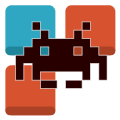

<div id="top"></div>

<!-- PROJECT SHIELDS -->
[![Contributors][contributors-shield]][contributors-url]
[![Forks][forks-shield]][forks-url]
[![Stargazers][stars-shield]][stars-url]
[![Issues][issues-shield]][issues-url]
[![MIT License][license-shield]][license-url]


<!-- PROJECT LOGO -->
<br />
<div align="center">
  <a href="https://github.com/Tikitikitikidesuka/0hh1-Bot">
    
  </a>

<h3 align="center">0h h1 Bot</h3>

  <p align="center">
    A bot for the game 0h h1
    <br />
    <a href="https://github.com/Tikitikitikidesuka/0hh1-Bot/issues">Report Bug</a>
    ·
    <a href="https://github.com/Tikitikitikidesuka/0hh1-Bot/issues">Request Feature</a>
  </p>
</div>


<!-- TABLE OF CONTENTS -->
<details>
  <summary>Table of Contents</summary>
  <ol>
    <li>
      <a href="#about-the-project">About The Project</a>
    </li>
    <li>
      <a href="#getting-started">Getting Started</a>
      <ul>
        <li><a href="#prerequisites">Prerequisites</a></li>
        <li><a href="#compilation">Compilation</a></li>
        <li><a href="#running">Running</a></li>
        <li><a href="#configuration">Configuration</a></li>
      </ul>
    </li>
    <li><a href="#usage">Usage</a></li>
    <li><a href="#contributing">Contributing</a></li>
    <li><a href="#license">License</a></li>
    <li><a href="#contact">Contact</a></li>
    <li><a href="#acknowledgments">Acknowledgments</a></li>
  </ol>
</details>


<!-- ABOUT THE PROJECT -->
## About The Project

**0h h1 Bot** automagically plays the browser game **[0h h1](https://0hh1.com/)** at ☆ﾐ blazing fast speeds ☆ﾐ.

|                            0 ms                            |                            100 ms                            |
|:----------------------------------------------------------:|:------------------------------------------------------------:|
| <image src="docs/assets/0msSolve.gif" width="256"></image> | <image src="docs/assets/100msSolve.gif" width="256"></image> |

The speed can be configured in case max speed feels too fast (｡•̀ᴗ-)✧.

<p align="right">(<a href="#top">back to top</a>)</p>


<!-- GETTING STARTED -->
## Getting Started

### Prerequisites

The only prerequisite is the java [JDK 17](https://www.oracle.com/java/technologies/downloads/#java17) or higher.

### Compilation

1. Clone the repo
   ```sh
   git clone https://github.com/Tikitikitikidesuka/0hh1-Bot.git
   ```
2. Compile the program
   ```sh
   javac Bot.java
   ```
   
### Running

To run the bot execute the previously compiled `Bot.class` with java
```sh
java Bot
```

You can also run the `jar` filed found in the [releases](https://github.com/Tikitikitikidesuka/0hh1-Bot/releases) section of the project page
```sh
java -jar 0hh1-Bot.jar
```

### Configuration

A config file is created on the first run.

- `click_speed`: Sets the speed of the clicks in milliseconds.
- `x_screen_offset`: Sets the screen horizontal offset. Only necessary for multi-monitor linux setups.
  (more info in the config file)

<p align="right">(<a href="#top">back to top</a>)</p>


<!-- USAGE EXAMPLES -->
## Usage

To use the bot, open **[0h h1](https://0hh1.com/)** on any browser **in fullscreen** (key _F11_ in most browsers) on the main monitor, start a game of any size and run the program.

The bot will scan the screen for the board, solve the board and output the result by taking control of the mouse.

<p align="right">(<a href="#top">back to top</a>)</p>


<!-- CONTRIBUTING -->
## Contributing

If you have a suggestion that would make this better, please fork the repo and create a pull request.

1. Fork the Project
2. Create your Feature Branch (`git checkout -b feature/AmazingFeature`)
3. Commit your Changes (`git commit -m 'Add some AmazingFeature'`)
4. Push to the Branch (`git push origin feature/AmazingFeature`)
5. Open a Pull Request

<p align="right">(<a href="#top">back to top</a>)</p>


<!-- LICENSE -->
## License

Distributed under the MIT License. See `LICENSE.txt` for more information.

<p align="right">(<a href="#top">back to top</a>)</p>


<!-- CONTACT -->
## Contact

Tikitikitikidesuka - deesneakygerbil@example.com

Project Link: [https://github.com/tikitikitikidesuka/0hh1-bot](https://github.com/tikitikitikidesuka/0hh1-bot)

<p align="right">(<a href="#top">back to top</a>)</p>


<!-- ACKNOWLEDGMENTS -->
## Acknowledgments

* [0h h1 Game](https://0hh1.com/)
* [README.md Template](https://github.com/othneildrew/Best-README-Template/blob/master/README.md)

<p align="right">(<a href="#top">back to top</a>)</p>


<!-- MARKDOWN LINKS & IMAGES -->
[contributors-shield]: https://img.shields.io/github/contributors/tikitikitikidesuka/0hh1-Bot.svg?style=for-the-badge
[contributors-url]: https://github.com/Tikitikitikidesuka/0hh1-Bot/graphs/contributors
[forks-shield]: https://img.shields.io/github/forks/tikitikitikidesuka/0hh1-Bot.svg?style=for-the-badge
[forks-url]: https://github.com/Tikitikitikidesuka/0hh1-Bot/network/members
[stars-shield]: https://img.shields.io/github/stars/tikitikitikidesuka/0hh1-Bot.svg?style=for-the-badge
[stars-url]: https://github.com/Tikitikitikidesuka/0hh1-Bot/stargazers
[issues-shield]: https://img.shields.io/github/issues/tikitikitikidesuka/0hh1-Bot.svg?style=for-the-badge
[issues-url]: https://github.com/Tikitikitikidesuka/0hh1-Bot/issues
[license-shield]: https://img.shields.io/github/license/tikitikitikidesuka/0hh1-Bot.svg?style=for-the-badge
[license-url]: https://github.com/Tikitikitikidesuka/0hh1-Bot/blob/master/LICENSE.txt
